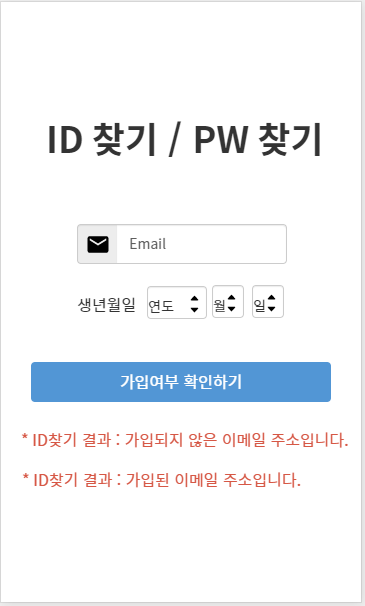

# README


## 미미여지도(美味輿地圖)🍜🚂

> 아무 계획 없이 훌쩍 떠나고 싶은 사람들을 위한, **여행** **코스** 및 코스별 **맛집** **추천** 서비스


### 🔎기획 의도

◽  코로나 사태 장기화로 인한 해외여행 대비 **국내여행**의 **수요** 크게 **증가** ↑

◽  관광지 / 맛집 추천 서비스는 각각 존재하지만, **관광지**와 **근처 맛집**을 **함께** **추천**해주는

​    서비스는 **無**

=> 💡 사용자의 취향을 고려하여 **국내 여행객 전용 관광지 & 근처 맛집 추천 서비스**를 기획해보자.


### ✨주요 기능

> 자세한 기능은 기능 명세서에서 확인하실 수 있습니다. (Ctrl + 아래 주소 클릭)
>
> https://docs.google.com/spreadsheets/d/18nlyakmLrgUU5De-nWTez9Yta9c3UYm0UJAfjQzl4-U/edit#gid=89059435

◻  **맛집 검색**

​	◽  주소, 가게명, 지역 등 사용자가 원하는 키워드로 전국에 있는 맛집 검색 가능

​	◽  검색어에 해당하는 맛집들이 리스트 형태로 주어지고, 해당 맛집 클릭 시 맛집 상세 페이지로 이동

◻  **여행 코스 추천** 

​	◽  선택한 옵션에 알맞는 여행 코스를 추천

​		 ◽  옵션 : [지역] , [여행 테마]

  		◽  코스는 4개의 관광지로 이루어 짐

​    ◽  코스 커스텀 - 추천 여행 코스에 속한 각각의 관광지는 아래의 관광지 리스트에 있는 관광지로 교체 가능

​		 ◽  사용자와의 매칭 정도를 기준으로 관광지 리스트 분류 ([전체] , [상] , [중] , [하])

​		  ◽  관광지 데이터를 지역, 테마별로 분류 후 각각의 테마 별 관련도를 점수화한 것을 기준으로 매칭 정도를 구				분한다.

 		 ◽  코스 최적화 - 관광지별 거리를 계산해 최단 거리로 관광지 순서를 재배열하여 코스를 최적화 해 줌

◻  **코스 주변 맛집 추천**

​	◽  여행 코스에 추천된 관광지 주변 맛집을 추천

​    ◽  맛집을 클릭하면 상세 정보를 볼 수 있는 맛집 상세 페이지로 이동

​		  ◽  맛집 리스트 기준 : [근처 맛집] , [키워드 맛집]

​		  ◽  근처 맛집은 원하는 필터를 적용한 맛집 리스트를 추천 받을 수 있음

​	 ◽  필터 : [빅데이터 분석] / [별점 순] , [리뷰 순]

 		 ◽  가게 리뷰를 분석하여 워드 클라우드 형식으로 키워드 제공
 	
 			 ◽  키워드를 클릭하여 관련 맛집 추천 받을 수 있음

◻  **맛집 타임라인**

​	◽  사용자가 방문한 맛집들을 정리해두는 기능

​		  ◽  사용자 다이어리에서 방문 체크가 된 맛집들의 정보가 날짜별로 불러와짐

◻  **다이어리**

​	◽  사용자의 일정을 정리할 수 있는 기능

 		◽  캘린더 : 사용자가 등록한 맛집과 여행 코스 정보를 한눈에 확인할 수 있는 일정 달력

​		 ◽  일자별 상세 일정 : 해당 날짜에 등록된 맛집과 여행 코스 정보를 확인할 수 있음

​			 ◽  방문 여부에 체크를 하면 나의 맛집 타임라인에 정보가 저장

​			 ◽  방문 여부가 체크되면 리뷰를 작성할 수 있음


### 👨‍💻기술 스택

**Tools**

◽ GitLab : 코드 버전 관리

◽ Jira : 이슈 관리

◽ VS Code : 코드 구현 툴

◽ SonarQube : 소스 코드 품질 관리

**Library**

◽ Django : [백엔드] Python web framework

◽ Vue.js : [프론트엔드] JavaScript framework

**Software Language**

◽ Python : 백엔드 및 빅데이터 분석 언어

◽ JavaScript : 프론트엔드 구현 언어


### 🔨Install

**Backend**

```sh
anaconda 20.11version 설치 (python 3.8.5)
python -m venv env - 가상환경 설치
source ./env/Scripts/activate - 가상환경 실행
cd sub2/backend
pip install -r requirements.txt
python manage.py makemigrations
python manage.py migrate
python manage.py initialize
python manage.py runserver
```

**Frontend**

```sh
npm install
npm run serve
```


### 📜설계 산출물

**ERD**


**Wire Frame**





### 📆일정


### 🌈Color Map


### 👭팀 소개👨‍👨‍👦

**김동걸** : Backend

**김유리** : Frontend

**김지은** : Frontend, 팀장

**안동규** : Backend

**안세익** : Frontend