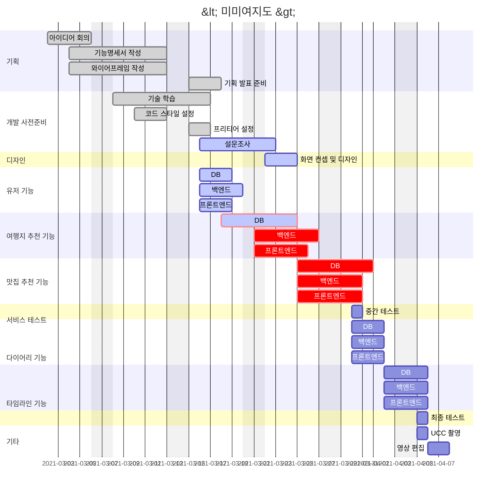

```mermaid
gantt
	dateFormat	YYYY-MM-DD
	title		< 미미여지도 >
	excludes	weekends
	%% (`excludes` accepts specific dates in YYYY-MM-DD format, days of the week ("sunday") or "weekends", but not the word "weekdays".)
	
	section 기획
    아이디어 회의            :done,    des1, 2021-03-02,4d
    기능명세서 작성         :done,  des1, 2021-03-04, 7d
    와이어프레임 작성			:done,  des1, 2021-03-04, 7d
    기획 발표 준비			:done,  des1, 2021-03-15, 3d
    
    section 개발 사전준비
    기술 학습				:done,  des2, 2021-03-08, 7d
    코드 스타일 설정         :done,  des2, 2021-03-10, 3d
    프리티어 설정            :done,    des2, 2021-03-15,2d
    설문조사				:active, 2021-03-16, 5d
    
    section 디자인
    화면 컨셉 및 디자인			:active, 2021-03-22, 3d 
    
    section 유저 기능
    DB         :active,  des2, 2021-03-16, 3d
    백엔드            :active,    des1, 2021-03-16,4d
    프론트엔드         :active,  des2, 2021-03-16, 3d
    
    section 여행지 추천 기능
    DB         :crit, active, 2021-03-18, 5d
    백엔드            :crit, des1, 2021-03-21, 6d
    프론트엔드         :crit, des1, 2021-03-21, 5d
    
    section 맛집 추천 기능
    DB         :crit, des1, 2021-03-25, 5d
    백엔드            :crit, des1, 2021-03-25, 4d
    프론트엔드         :crit, des1, 2021-03-25, 4d
    
    section 서비스 테스트
    중간 테스트            :des1, 2021-03-30,1d
    
    section 다이어리 기능
    DB         :des1, 2021-03-30, 3d
    백엔드            :des1, 2021-03-30, 3d
    프론트엔드         :des1, 2021-03-30, 3d
    
    section 타임라인 기능
    DB         :des1, 2021-04-02, 2d
    백엔드            :des1, 2021-04-02, 2d
    프론트엔드         :des1, 2021-04-02, 2d
    
    section 서비스 테스트
    최종 테스트            :des1, 2021-04-05,1d
	
	section 기타
    UCC 촬영         :des1, 2021-04-05,1d
    영상 편집         :des1, 2021-04-06,2d
```

