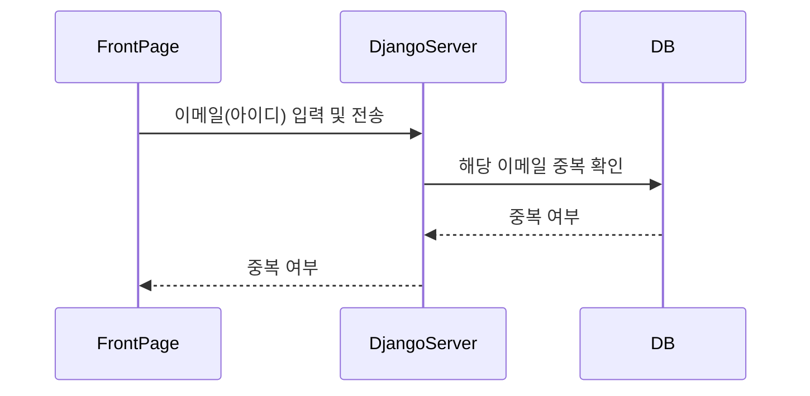
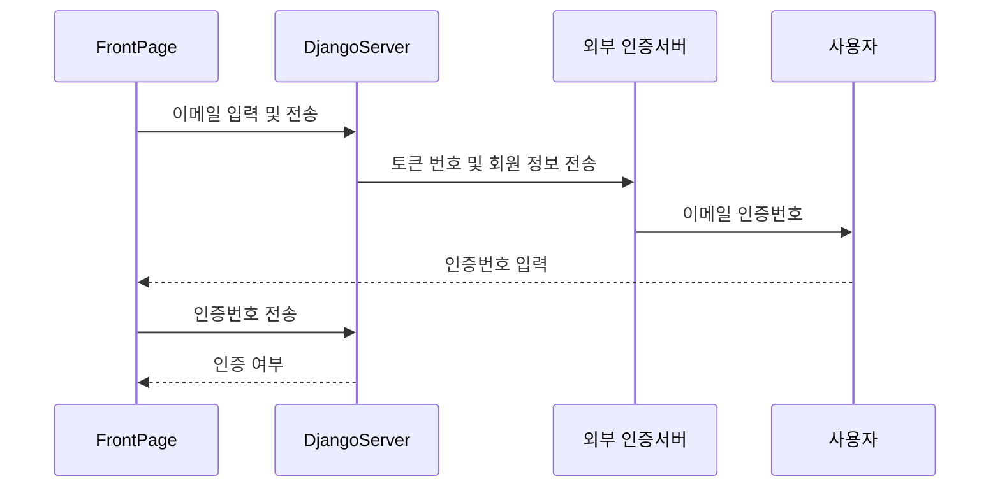
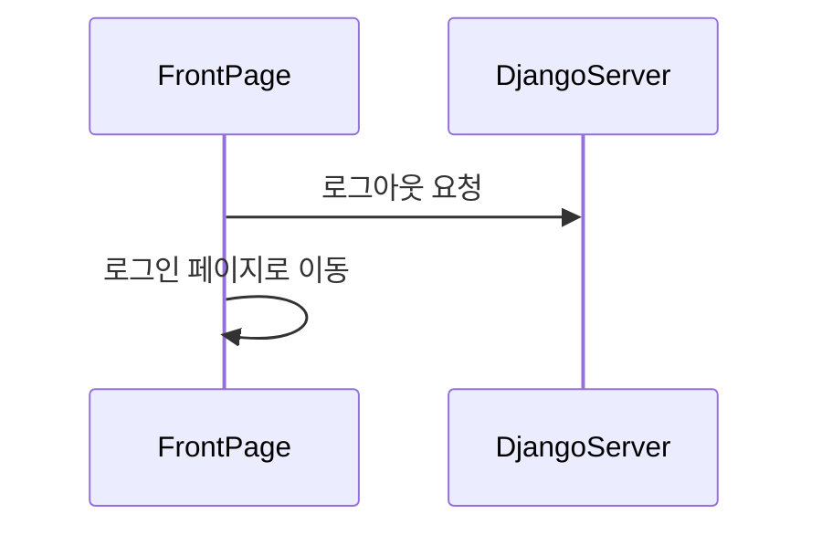
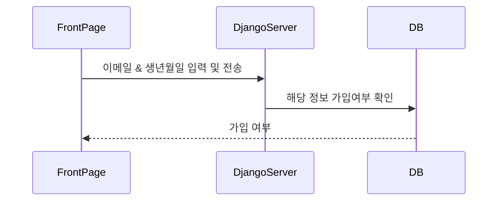
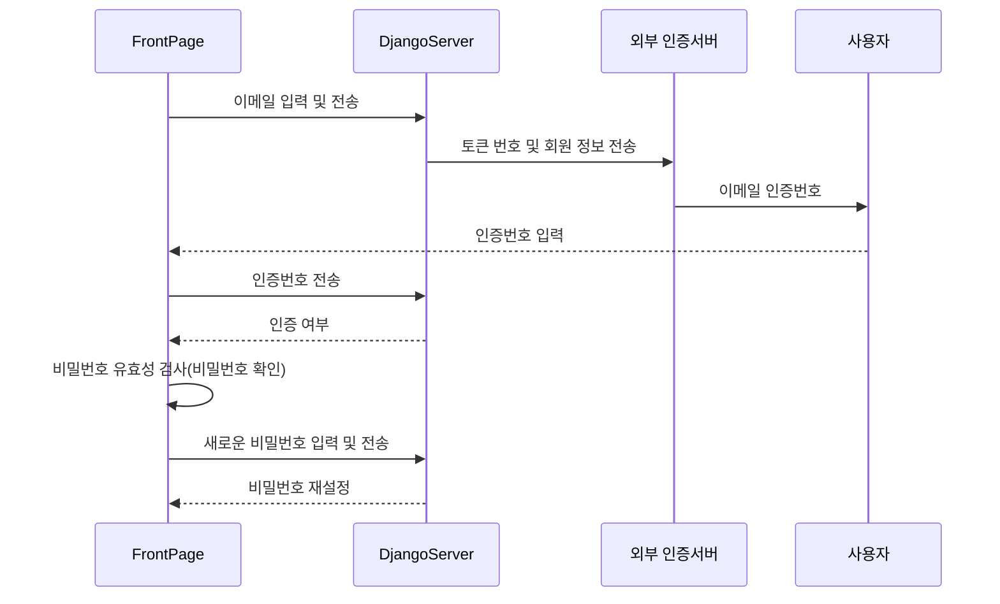
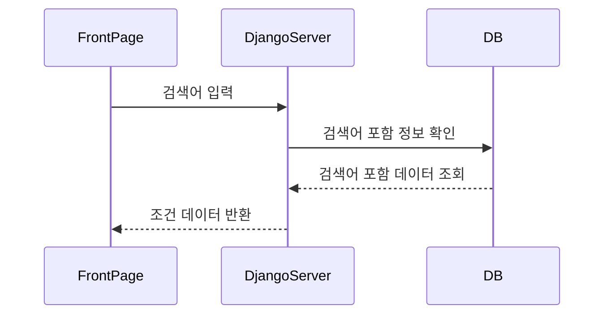
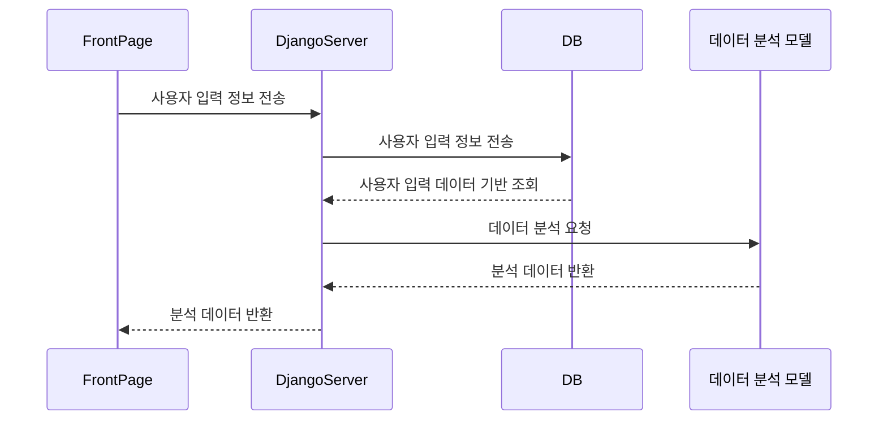
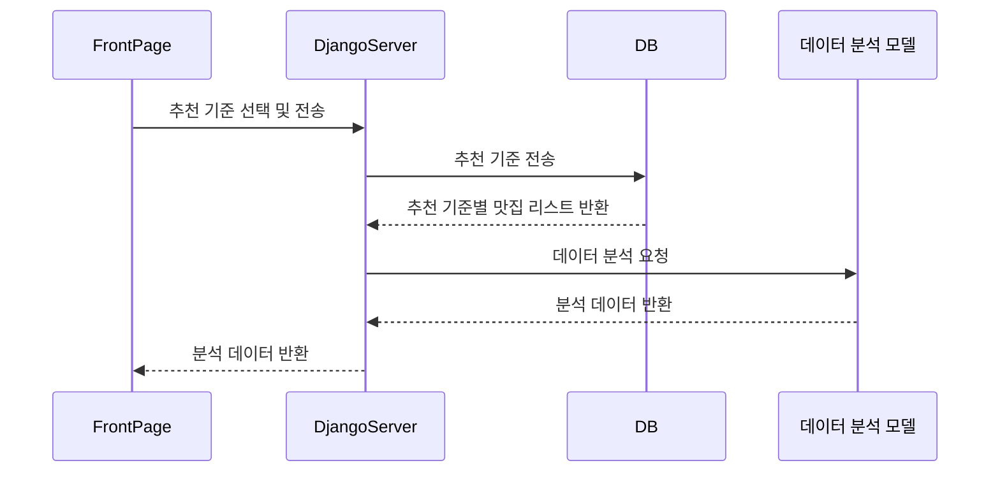

# 특화 프로젝트_Sequence Diagram

### [ 회원가입 ]

**아이디 중복 확인**

```mermaid
sequenceDiagram

FrontPage ->> DjangoServer : 이메일(아이디) 입력 및 전송
DjangoServer ->> DB : 해당 이메일 중복 확인

DB -->> DjangoServer : 중복 여부
DjangoServer -->> FrontPage : 중복 여부
```

**이메일 인증**

```mermaid
sequenceDiagram

FrontPage ->> DjangoServer : 이메일 입력 및 전송 

DjangoServer ->> 외부 인증서버 : 토큰 번호 및 회원 정보 전송

외부 인증서버 ->> 사용자 : 이메일 인증번호
사용자 -->> FrontPage : 인증번호 입력

FrontPage ->> DjangoServer : 인증번호 전송
DjangoServer -->> FrontPage : 인증 여부
```

### 

### [ 로그아웃 ]

```mermaid
sequenceDiagram

FrontPage ->> DjangoServer : 로그아웃 요청
FrontPage ->> FrontPage : 로그인 페이지로 이동
```

### [ ID/비밀번호 찾기 ]

**아이디 찾기**

```mermaid
sequenceDiagram

FrontPage ->> DjangoServer : 이메일 & 생년월일 입력 및 전송
DjangoServer ->> DB : 해당 정보 가입여부 확인
DB -->> FrontPage : 가입 여부
```

**비밀번호 찾기**

```mermaid
sequenceDiagram

FrontPage ->> DjangoServer : 이메일 입력 및 전송 

DjangoServer ->> 외부 인증서버 : 토큰 번호 및 회원 정보 전송

외부 인증서버 ->> 사용자 : 이메일 인증번호
사용자 -->> FrontPage : 인증번호 입력

FrontPage ->> DjangoServer : 인증번호 전송
DjangoServer -->> FrontPage : 인증 여부

FrontPage ->> FrontPage : 비밀번호 유효성 검사(비밀번호 확인)
FrontPage ->> DjangoServer : 새로운 비밀번호 입력 및 전송
DjangoServer -->> FrontPage : 비밀번호 재설정
```

### [ 맛집 검색 ]

```mermaid
sequenceDiagram

FrontPage ->> DjangoServer : 검색어 입력
DjangoServer ->> DB : 검색어 포함 정보 확인

DB -->> DjangoServer : 검색어 포함 데이터 조회
DjangoServer -->> FrontPage : 조건 데이터 반환
```

### [ 코스 추천 ]

```mermaid
sequenceDiagram

FrontPage ->> DjangoServer : 사용자 입력 정보 전송
DjangoServer ->> DB : 사용자 입력 정보 전송
DB -->> DjangoServer : 사용자 입력 데이터 기반 조회
DjangoServer ->> 데이터 분석 모델 : 데이터 분석 요청
데이터 분석 모델 -->> DjangoServer : 분석 데이터 반환
DjangoServer -->> FrontPage : 분석 데이터 반환
```

### [ 맛집 추천 ]

```mermaid
sequenceDiagram

FrontPage ->> DjangoServer : 추천 기준 선택 및 전송
DjangoServer ->> DB : 추천 기준 전송
DB -->> DjangoServer : 추천 기준별 맛집 리스트 반환
DjangoServer ->> 데이터 분석 모델 : 데이터 분석 요청
데이터 분석 모델 -->> DjangoServer : 분석 데이터 반환
DjangoServer -->> FrontPage : 분석 데이터 반환
```

